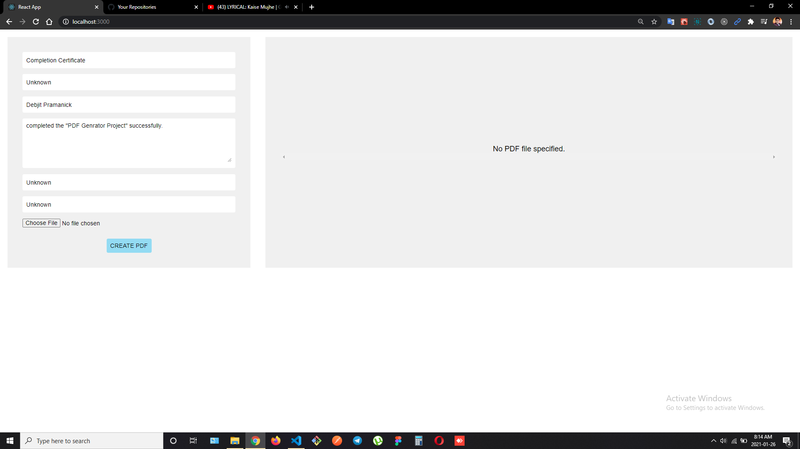
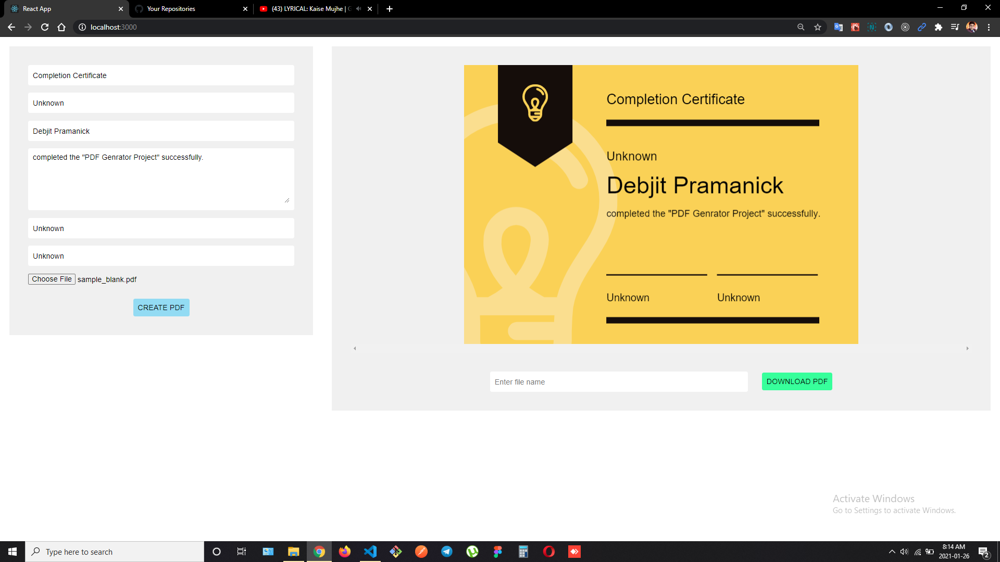

# PDF Generator

Hi! I'm Debjit, a **MERN Stack Developer**. This is a simple **PDF Generator** App.
I have created it with **React JS** in frontend.
 
 
 
 
> ### Web App Link - https://whatsapp-clone-mern.netlify.app/

 

## Features

- Enter required details in the form.
- Select Template.
- Create PDF.

##  NPM Packages Used

- React-pdf
- PDF-lib
- Kendo-file-saver

## Screenshots

 

 
 
 
### Check template folder to download the sample template.
